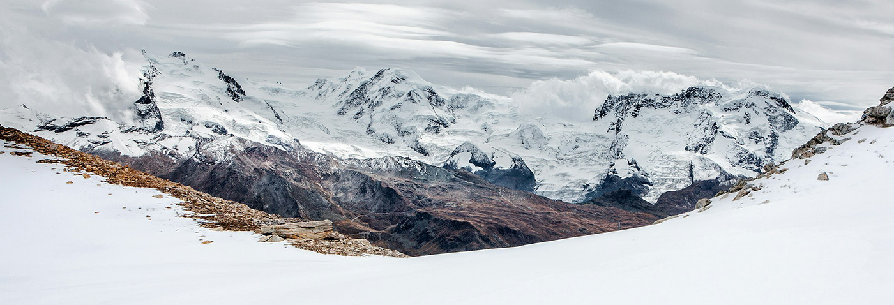
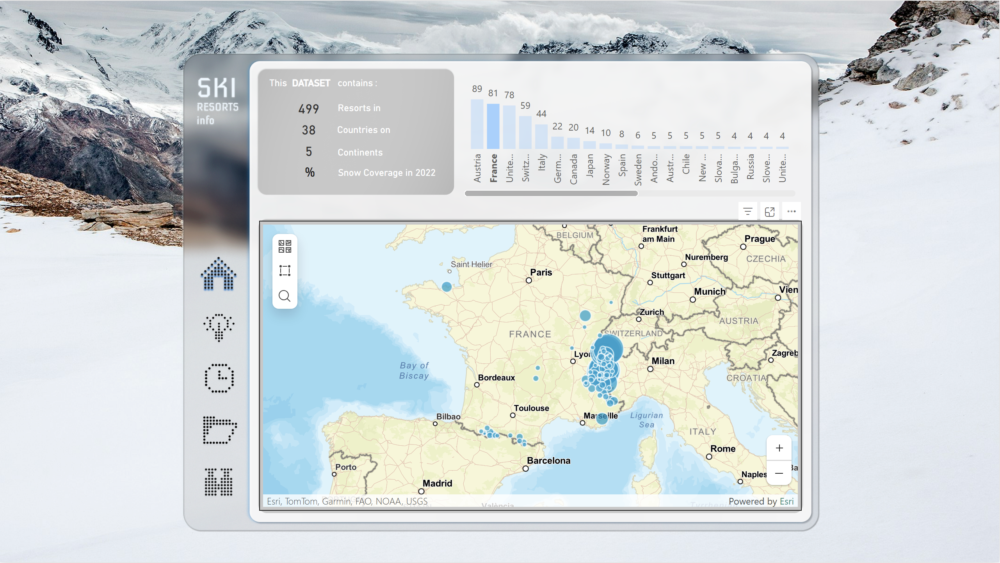

# SKI RESORTS CATALOGUE APP IN POWER BI

This repository contains the **Ski Resorts Catalogue App** created in Power BI. It includes detailed information about approximately 500 ski resorts worldwide, covering location, prices, slopes, lifts, seasons, and a supplementary table with snow cover data for each month of 2022.

The project was an attempt to explore Power BI’s capabilities for creating app-like dashboards.

---

## Table of Contents
1. [Project Overview](#project-overview)
2. [Objectives](#objectives)
3. [Dataset](#dataset)
4. [App Structure](#app-structure)
5. [App Interface](#app-interface)
6. [Requirements](#requirements)
7. [Contributing](#contributing)
8. [License](#license)
9. [Credits and Acknowledgements](#credits-and-acknowledgements)
10. [Author](#author)

---

## Project Overview

### Tools Used
- **Power BI** – building the app  
- **Figma** – prototyping visualization  
- **Excel** – data merging  

**Key Components:**
- Dataset: `resorts.csv`, `snow.csv`  
- Power BI file: `SkiResortsProject.pbix`

---

## Objectives

The project aims to answer questions such as:

- In which countries are the most ski resorts located? Are there noticeable clusters?  
- How do ski seasons differ depending on location? Does this reflect snow cover?  
- Which resorts have the highest mountain peaks and elevation differences?  
- Which resorts are best for beginners? And which for experts?

---

## Dataset

**Size:** 499 rows

| Table   | Column                 | Description |
|---------|------------------------|-------------|
| Resorts | ID                     | Unique identifier for each resort |
| Resorts | Resort                 | Name of the ski & snowboard resort |
| Resorts | Latitude               | Latitude of the resort's location |
| Resorts | Longitude              | Longitude of the resort's location |
| Resorts | Country                | Country in which the resort is located |
| Resorts | Continent              | Continent in which the resort is located |
| Resorts | Price                  | Ski pass cost for 1 adult for 1 day in the main season (Euro - €) |
| Resorts | Season                 | Normal start and end of the ski season (weather dependent) |
| Resorts | Highest point          | Highest mountain point at the resort (meters) |
| Resorts | Lowest point           | Lowest possible point to ski at the resort (meters) |
| Resorts | Beginner slopes        | Total length of "children", "blue", and "green" slopes (km) |
| Resorts | Intermediate slopes    | Total length of "red" slopes (km) |
| Resorts | Difficult slopes       | Total length of "black", "advanced", and "expert" slopes (km) |
| Resorts | Total slopes           | Total length of all slopes (km) |
| Resorts | Longest run            | Longest continuous run at the resort (km) |
| Resorts | Snow cannons           | Total number of snow cannons |
| Resorts | Surface lifts          | Number of surface lifts (T-bar, Sunkidslift, Rope lifts, people movers) |
| Resorts | Chair lifts            | Total number of chair lifts |
| Resorts | Gondola lifts          | Total number of gondola-type lifts (Gondola, Funicular, etc.) |
| Resorts | Total lifts            | Total number of lifts |
| Resorts | Lift capacity          | Passengers the lift system can move per hour |
| Resorts | Child friendly         | Is the resort child-friendly? |
| Resorts | Snowparks              | Does the resort have one or more snowparks? |
| Resorts | Nightskiing            | Does the resort offer illuminated slope skiing? |
| Resorts | Summer skiing          | Does the resort offer summer skiing? |
| Snow    | Month                  | Month of the year (full date format) |
| Snow    | Latitude               | Latitude at the center of the region (0.25x0.25 degrees) |
| Snow    | Longitude              | Longitude at the center of the region (0.25x0.25 degrees) |
| Snow    | Snow                   | Percent of time the region was snow-covered during the month |

---

## App Structure

1. **HOME** – Info about resorts on a map grouped by countries, general dataset overview.  
2. **RATE CHARTS** – Charts showing ratings by resorts and countries based on various criteria.  
3. **SEASON HEATMAP** – Heatmap with snow coverage percentage by month and ski season periods for each resort.  
4. **SKI RESORTS DETAILS MATRIX TABLE** – Detailed matrix table with all resort information.

---

## App Interface

  

---

## Requirements

To open the app:

1. Install **Power BI Desktop** (version 2.149.1429.0 recommended) from the [official website](https://www.microsoft.com/en-us/download/details.aspx?id=58494).  
2. Open the file: `SkiResortsProject.pbix`  
3. To update the dataset, reconnect the `.csv` files from the Dataset folder using **Power Query**.

---

## Contributing

Please follow standard best practices:

- Fork the repository  
- Create a feature branch  
- Commit with clear messages  
- Open a Pull Request

For regular contributions, consider adding:

- `CONTRIBUTING.md`  
- `CODE_OF_CONDUCT.md`

---

## License

This project is licensed under the **MIT License**.  
[View License](https://opensource.org/licenses/MIT)

---

## Credits and Acknowledgements

The content of this project reflects learning gained from **DAN.IT school** walkthrough projects.  

Development issues were resolved using official documentation, community forums, and online resources, including YouTube tutorials.

---

## Author

**Volodymyr Babunych**  
📧 [vbabunych@gmail.com](mailto:vbabunych@gmail.com)  
📍 United Kingdom  
🗓️ December 18, 2025
